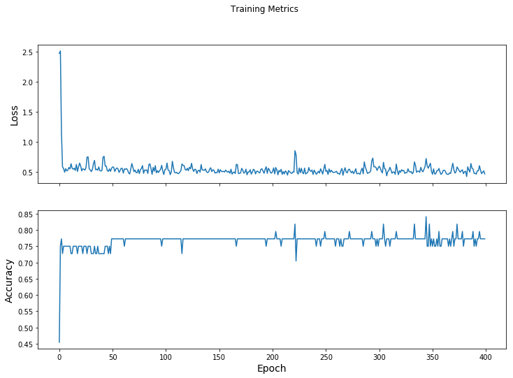
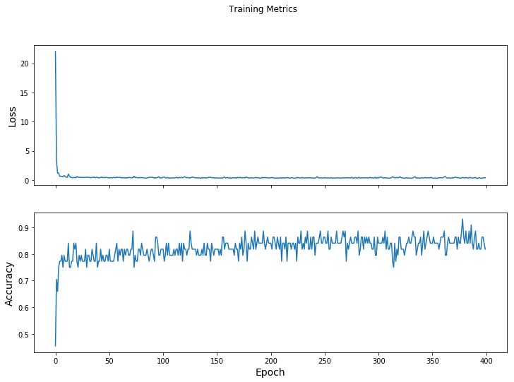
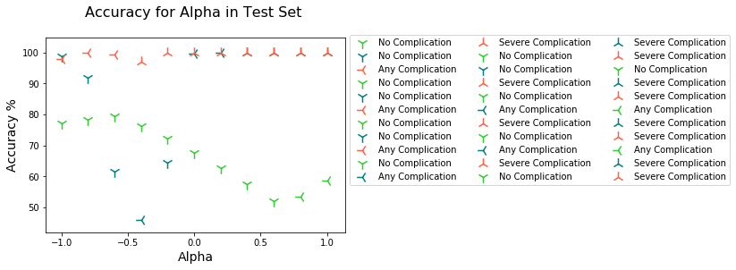

# $$\begin{align}\bar{x_i},\bar{y_i} \\ \bar{x_j},\bar{y_j} \\ x_0 \\ y_0 \\ Rc_{xy} \\ (x_i, y_i) \\ (x_j, y_j) \\ (x_0, y_0) \\ Aa_{(x_i, y_i)(x_j, y_j)(x_0, y_0)} \\ D_{m^x} = x_j - x_i \\ D_{m^y} = y_j - y_i \\ D_{m^x}, D_{m^y} > 0 \\ D_{m^x}, D_{m^y} < 0 \\ D_{m^x} > 0,D_{m^y} < 0 \\ D_{m^x} < 0,D_{m^y} > 0 \\ Rc_{xy} = \frac{D_{m^x}}{|D_{m^x}|}+\frac{D_{m^y}}{|D_{m^y}|} + \alpha \\ Rc_{xy}\times Aa\end{align}$$


```python
# python -m pip install --upgrade pip
# !pip install --upgrade tensorflow
# !pip show tensorflow
# !pip install --upgrade numpy
from __future__ import absolute_import, division, print_function
import os
import numpy
import matplotlib.pyplot as plt
import tensorflow as tf
tf.enable_eager_execution()
print("TensorFlow version: {}".format(tf.__version__))
print("Eager execution: {}".format(tf.executing_eagerly()))
```

    C:\Users\Manuel Mena\Anaconda3\lib\site-packages\h5py\__init__.py:36: FutureWarning: Conversion of the second argument of issubdtype from `float` to `np.floating` is deprecated. In future, it will be treated as `np.float64 == np.dtype(float).type`.
      from ._conv import register_converters as _register_converters
    

    TensorFlow version: 1.13.1
    Eager execution: True
    


```python
train_dataset_url = "https://storage.googleapis.com/tetraktys/sample2.csv"
train_dataset_fp = tf.keras.utils.get_file(fname=os.path.basename(train_dataset_url),origin=train_dataset_url)
print("Local copy of the dataset file: {}".format(train_dataset_fp))
# column order in CSV file
column_names = ['CRPD3', 'CRPD5', 'WBCD3', 'WBCD5', 'complication']
feature_names = column_names[:-1]
label_name = column_names[-1]
print("Features: {}".format(feature_names))
print("Label: {}".format(label_name))
class_names = ['No Complication', 'Any Complication', 'Severe Complication']
batch_size = 32
train_dataset = tf.contrib.data.make_csv_dataset(
    train_dataset_fp,
    batch_size, 
    column_names=column_names,
    label_name=label_name,
    num_epochs=1)
features, labels = next(iter(train_dataset));
features;
def pack_features_vector(features, labels):
  """Pack the features into a single array."""
  features = tf.stack(list(features.values()), axis=1)
  return features, labels
train_dataset = train_dataset.map(pack_features_vector)
features, labels = next(iter(train_dataset))
# print(features[:5])
model = tf.keras.Sequential([
  tf.keras.layers.Dense(10, activation=tf.nn.relu, input_shape=(4,)),  # input shape required
  tf.keras.layers.Dense(10, activation=tf.nn.relu),
  tf.keras.layers.Dense(3)
])
predictions = model(features)
# predictions[:5]
tf.nn.softmax(predictions[:5]);
# print("Prediction: {}".format(tf.argmax(predictions, axis=1)))
# print("    Labels: {}".format(labels))
def loss(model, x, y):
  y_ = model(x)
  return tf.losses.sparse_softmax_cross_entropy(labels=y, logits=y_)
l = loss(model, features, labels)
print("Loss test: {}".format(l))
def grad(model, inputs, targets):
  with tf.GradientTape() as tape:
    loss_value = loss(model, inputs, targets)
  return loss_value, tape.gradient(loss_value, model.trainable_variables)
optimizer = tf.train.GradientDescentOptimizer(learning_rate=0.01)
global_step = tf.Variable(0)
loss_value, grads = grad(model, features, labels)
print("Step: {}, Initial Loss: {}".format(global_step.numpy(),loss_value.numpy()))
optimizer.apply_gradients(zip(grads, model.trainable_variables), global_step)
print("Step: {},         Loss: {}".format(global_step.numpy(), loss(model, features, labels).numpy()))
## Note: Rerunning this cell uses the same model variables
from tensorflow import contrib
tfe = contrib.eager
# keep results for plotting
train_loss_results = []
train_accuracy_results = []
num_epochs = 400
for epoch in range(num_epochs):
  epoch_loss_avg = tfe.metrics.Mean()
  epoch_accuracy = tfe.metrics.Accuracy()
  # Training loop - using batches of 32
  for x, y in train_dataset:
    # Optimize the model
    loss_value, grads = grad(model, x, y)
    optimizer.apply_gradients(zip(grads, model.trainable_variables), global_step)
    # Track progress
    epoch_loss_avg(loss_value)  # add current batch loss
    # compare predicted label to actual label
    epoch_accuracy(tf.argmax(model(x), axis=1, output_type=tf.int32), y)
  # end epoch
  train_loss_results.append(epoch_loss_avg.result())
  train_accuracy_results.append(epoch_accuracy.result())
  if epoch % 50 == 0:
    print("Epoch {:03d}: Loss: {:.3f}, Accuracy: {:.3%}".format(epoch, epoch_loss_avg.result(), epoch_accuracy.result()))
fig, axes = plt.subplots(2, sharex=True, figsize=(12, 8))
fig.suptitle('Training Metrics')
axes[0].set_ylabel("Loss", fontsize=14)
axes[0].plot(train_loss_results)
axes[1].set_ylabel("Accuracy", fontsize=14)
axes[1].set_xlabel("Epoch", fontsize=14)
axes[1].plot(train_accuracy_results);

import math
import numpy as np
import matplotlib.pyplot as plt
import itertools
colors = itertools.cycle(["green", "limegreen", "tomato"])
test_url = "https://storage.googleapis.com/ddw/SAMPLE.csv"
test_fp = tf.keras.utils.get_file(fname=os.path.basename(test_url),origin=test_url)
test_dataset = tf.contrib.data.make_csv_dataset(
    test_fp,
    batch_size, 
    column_names=column_names,
    label_name='complication',
    num_epochs=1,
    shuffle=False)
test_dataset = test_dataset.map(pack_features_vector)
test_accuracy = tfe.metrics.Accuracy()
for (x, y) in test_dataset:
  logits = model(x)
  prediction = tf.argmax(logits, axis=1, output_type=tf.int32)
  test_accuracy(prediction, y)
print("Test set accuracy: {:.3%}".format(test_accuracy.result()))
tf.stack([y,prediction],axis=1);

CRPc1d3 = 128; CRPc1d5 = 100; WBCc1d3 = 8.78; WBCc1d5 = 7.39; # NC
CRPc2d3 = 136; CRPc2d5 = 240; WBCc2d3 = 14.82; WBCc2d5 = 7.16; # AC
CRPc3d3 = 80; CRPc3d5 = 190; WBCc3d3 = 4.25; WBCc3d5 = 14.56; # SC

predict_dataset = tf.convert_to_tensor([
        [CRPc1d3, CRPc1d5, WBCc1d3, WBCc1d5,],
        [CRPc2d3, CRPc2d5, WBCc2d3, WBCc2d5,],
        [CRPc3d3, CRPc3d5, WBCc3d3, WBCc3d5]
    ])        
predictions = model(predict_dataset)
for i, logits in enumerate(predictions):
    class_idx = tf.argmax(logits).numpy()
    p = tf.nn.softmax(logits)[class_idx]
    name = class_names[class_idx]
    print("Example {} prediction: {} ({:4.1f}%)".format(i, name, 100*p))
```

    Local copy of the dataset file: C:\Users\Manuel Mena\.keras\datasets\sample2.csv
    Features: ['CRPD3', 'CRPD5', 'WBCD3', 'WBCD5']
    Label: complication
    Loss test: 12.83625316619873
    Step: 0, Initial Loss: 12.83625316619873
    Step: 1,         Loss: 1.895335078239441
    Epoch 000: Loss: 2.468, Accuracy: 45.455%
    Epoch 050: Loss: 0.581, Accuracy: 77.273%
    Epoch 100: Loss: 0.544, Accuracy: 77.273%
    Epoch 150: Loss: 0.481, Accuracy: 77.273%
    Epoch 200: Loss: 0.504, Accuracy: 77.273%
    Epoch 250: Loss: 0.505, Accuracy: 77.273%
    Epoch 300: Loss: 0.592, Accuracy: 77.273%
    Epoch 350: Loss: 0.458, Accuracy: 75.000%
    Test set accuracy: 86.364%
    Example 0 prediction: No Complication (69.9%)
    Example 1 prediction: Severe Complication (97.0%)
    Example 2 prediction: Severe Complication (100.0%)
    





```python
train_dataset_url = "https://storage.googleapis.com/tetraktys/e2.csv"
train_dataset_fp = tf.keras.utils.get_file(fname=os.path.basename(train_dataset_url),origin=train_dataset_url)
print("Local copy of the dataset file: {}".format(train_dataset_fp))
# column order in CSV file
column_names = ['Aa', 'a', 'b', 'c', 'complication']
feature_names = column_names[:-1]
label_name = column_names[-1]
print("Features: {}".format(feature_names))
print("Label: {}".format(label_name))
class_names = ['No Complication', 'Any Complication', 'Severe Complication']
batch_size = 32
train_dataset = tf.contrib.data.make_csv_dataset(
    train_dataset_fp,
    batch_size, 
    column_names=column_names,
    label_name=label_name,
    num_epochs=1)
features, labels = next(iter(train_dataset));
features;
def pack_features_vector(features, labels):
  """Pack the features into a single array."""
  features = tf.stack(list(features.values()), axis=1)
  return features, labels
train_dataset = train_dataset.map(pack_features_vector)
features, labels = next(iter(train_dataset))
# print(features[:5])
model = tf.keras.Sequential([
  tf.keras.layers.Dense(10, activation=tf.nn.relu, input_shape=(4,)),  # input shape required
  tf.keras.layers.Dense(10, activation=tf.nn.relu),
  tf.keras.layers.Dense(3)])
predictions = model(features)
# predictions[:5]
tf.nn.softmax(predictions[:5]);
# print("Prediction: {}".format(tf.argmax(predictions, axis=1)))
# print("    Labels: {}".format(labels))
def loss(model, x, y):
  y_ = model(x)
  return tf.losses.sparse_softmax_cross_entropy(labels=y, logits=y_)
l = loss(model, features, labels)
print("Loss test: {}".format(l))
def grad(model, inputs, targets):
  with tf.GradientTape() as tape:
    loss_value = loss(model, inputs, targets)
  return loss_value, tape.gradient(loss_value, model.trainable_variables)
optimizer = tf.train.GradientDescentOptimizer(learning_rate=0.01)
global_step = tf.Variable(0)
loss_value, grads = grad(model, features, labels)
print("Step: {}, Initial Loss: {}".format(global_step.numpy(),loss_value.numpy()))
optimizer.apply_gradients(zip(grads, model.trainable_variables), global_step)
print("Step: {},         Loss: {}".format(global_step.numpy(), loss(model, features, labels).numpy()))
## Note: Rerunning this cell uses the same model variables
from tensorflow import contrib
tfe = contrib.eager
# keep results for plotting
train_loss_results = []
train_accuracy_results = []
num_epochs = 400
for epoch in range(num_epochs):
  epoch_loss_avg = tfe.metrics.Mean()
  epoch_accuracy = tfe.metrics.Accuracy()
  # Training loop - using batches of 32
  for x, y in train_dataset:
    # Optimize the model
    loss_value, grads = grad(model, x, y)
    optimizer.apply_gradients(zip(grads, model.trainable_variables), global_step)
    # Track progress
    epoch_loss_avg(loss_value)  # add current batch loss
    # compare predicted label to actual label
    epoch_accuracy(tf.argmax(model(x), axis=1, output_type=tf.int32), y)
  # end epoch
  train_loss_results.append(epoch_loss_avg.result())
  train_accuracy_results.append(epoch_accuracy.result())
  if epoch % 50 == 0:
    print("Epoch {:03d}: Loss: {:.3f}, Accuracy: {:.3%}".format(epoch, epoch_loss_avg.result(), epoch_accuracy.result()))
fig, axes = plt.subplots(2, sharex=True, figsize=(12, 8))
fig.suptitle('Training Metrics')
axes[0].set_ylabel("Loss", fontsize=14)
axes[0].plot(train_loss_results)
axes[1].set_ylabel("Accuracy", fontsize=14)
axes[1].set_xlabel("Epoch", fontsize=14)
axes[1].plot(train_accuracy_results);
```

    Local copy of the dataset file: C:\Users\Manuel Mena\.keras\datasets\e2.csv
    Features: ['Aa', 'a', 'b', 'c']
    Label: complication
    Loss test: 32.432273864746094
    Step: 0, Initial Loss: 32.432273864746094
    Step: 1,         Loss: 30.859477996826172
    Epoch 000: Loss: 22.009, Accuracy: 45.455%
    Epoch 050: Loss: 0.324, Accuracy: 81.818%
    Epoch 100: Loss: 0.466, Accuracy: 81.818%
    Epoch 150: Loss: 0.340, Accuracy: 81.818%
    Epoch 200: Loss: 0.384, Accuracy: 84.091%
    Epoch 250: Loss: 0.403, Accuracy: 86.364%
    Epoch 300: Loss: 0.352, Accuracy: 84.091%
    Epoch 350: Loss: 0.328, Accuracy: 84.091%
    





```python
import math
import numpy as np
import matplotlib.pyplot as plt
import itertools
colors = itertools.cycle(["limegreen", "teal", "tomato"])
test_url = "https://storage.googleapis.com/tetraktys/e2.csv"
test_fp = tf.keras.utils.get_file(fname=os.path.basename(test_url),origin=test_url)
test_dataset = tf.contrib.data.make_csv_dataset(
    test_fp,
    batch_size, 
    column_names=column_names,
    label_name='complication',
    num_epochs=1,
    shuffle=False)
test_dataset = test_dataset.map(pack_features_vector)
test_accuracy = tfe.metrics.Accuracy()
for (x, y) in test_dataset:
  logits = model(x)
  prediction = tf.argmax(logits, axis=1, output_type=tf.int32)
  test_accuracy(prediction, y)
print("Test set accuracy: {:.3%}".format(test_accuracy.result()))
tf.stack([y,prediction],axis=1);
#
n_alpha = 10
h_alpha = range(-10,n_alpha+1,2)
d_alpha = n_alpha
#
CRPc1d3 = 128; CRPc1d5 = 100; WBCc1d3 = 8.78; WBCc1d5 = 7.39;
CRPc2d3 = 136; CRPc2d5 = 240; WBCc2d3 = 14.82; WBCc2d5 = 7.16;
CRPc3d3 = 80; CRPc3d5 = 190; WBCc3d3 = 4.25; WBCc3d5 = 14.56;
#
for alpha in h_alpha:
    alpha = alpha/d_alpha
    Cr1 = (((CRPc1d5-CRPc1d3)/abs(CRPc1d5-CRPc1d3)+(WBCc1d5-WBCc1d3)/abs(WBCc1d5-WBCc1d3))/2)+alpha;
    a1 = math.sqrt(((CRPc1d3-20)**2)+((WBCc1d3-5)**2)); 
    b1 = math.sqrt(((CRPc1d5-20)**2)+((WBCc1d5-5)**2)); 
    c1 = math.sqrt(((CRPc1d5-CRPc1d3)**2)+((WBCc1d5-WBCc1d3)**2)); 
    s1 = (1/2)*(a1+b1+c1); 
    Aa1 = Cr1*(math.sqrt(s1*((s1-a1)*(s1-b1)*(s1-c1))));    
    Cr2 = (((CRPc2d5-CRPc2d3)/abs(CRPc2d5-CRPc2d3)+(WBCc2d5-WBCc2d3)/abs(WBCc2d5-WBCc2d3))/2)+alpha;
    a2 = math.sqrt(((CRPc2d3-20)**2)+((WBCc2d3-5)**2));
    b2 = math.sqrt(((CRPc2d5-20)**2)+((WBCc2d5-5)**2)); 
    c2 = math.sqrt(((CRPc2d5-CRPc2d3)**2)+((WBCc2d5-WBCc2d3)**2)); 
    s2 = (1/2)*(a2+b2+c2); 
    Aa2 = Cr2*(math.sqrt(s2*((s2-a2)*(s2-b2)*(s2-c2)))); 
    Cr3 = (((CRPc3d5-CRPc3d3)/abs(CRPc3d5-CRPc3d3)+(WBCc3d5-WBCc3d3)/abs(WBCc3d5-WBCc3d3))/2)+alpha;
    a3= math.sqrt(((CRPc3d3-20)**2)+((WBCc3d3-5)**2)); 
    b3 = math.sqrt(((CRPc3d5-20)**2)+((WBCc3d5-5)**2));
    c3 = math.sqrt(((CRPc3d5-CRPc3d3)**2)+((WBCc3d5-WBCc3d3)**2)); 
    s3 = (1/2)*(a3+b3+c3); 
    Aa3 = Cr3*(math.sqrt(s3*((s3-a3)*(s3-b3)*(s3-c3))));
#
    predict_dataset = tf.convert_to_tensor([
        [Aa1, a1, b1, c1,],
        [Aa2, a2, b2, c2,],
        [Aa3, a3, b3, c3]
    ])        
    predictions = model(predict_dataset)
    mk='1'
    for i, logits in enumerate(predictions):
        class_idx = tf.argmax(logits).numpy()
        p = tf.nn.softmax(logits)[class_idx]
        name = class_names[class_idx]
        print("Example {} prediction: {} ({:4.1f}%)".format(i, name, 100*p))
        x = alpha
        y = 100*p
        if name == 'Severe Complication':
            mk = '2'
        elif name == 'Any Complication':
            mk = '3'
        elif name == 'No Complication':
            mk = '1'
        plt.scatter(x, y, color=next(colors), marker=mk, s=160, label=(name))
        plt.legend(loc='upper left', numpoints=1, ncol=3, fontsize=10, bbox_to_anchor=(1, 1.04))
plt.xlabel('Alpha',fontsize=14)
plt.ylabel('Accuracy %', fontsize=14)
plt.title('Accuracy for Alpha in Test Set \n', fontsize=16)
plt.show()
```

    Test set accuracy: 84.091%
    Example 0 prediction: No Complication (77.2%)
    Example 1 prediction: No Complication (98.7%)
    Example 2 prediction: Any Complication (97.7%)
    Example 0 prediction: No Complication (78.3%)
    Example 1 prediction: No Complication (91.8%)
    Example 2 prediction: Any Complication (100.0%)
    Example 0 prediction: No Complication (79.5%)
    Example 1 prediction: No Complication (61.4%)
    Example 2 prediction: Any Complication (99.2%)
    Example 0 prediction: No Complication (76.2%)
    Example 1 prediction: Any Complication (45.9%)
    Example 2 prediction: Severe Complication (97.1%)
    Example 0 prediction: No Complication (72.1%)
    Example 1 prediction: No Complication (64.5%)
    Example 2 prediction: Severe Complication (100.0%)
    Example 0 prediction: No Complication (67.5%)
    Example 1 prediction: Any Complication (99.5%)
    Example 2 prediction: Severe Complication (100.0%)
    Example 0 prediction: No Complication (62.6%)
    Example 1 prediction: Any Complication (100.0%)
    Example 2 prediction: Severe Complication (100.0%)
    Example 0 prediction: No Complication (57.4%)
    Example 1 prediction: Severe Complication (100.0%)
    Example 2 prediction: Severe Complication (100.0%)
    Example 0 prediction: No Complication (52.0%)
    Example 1 prediction: Severe Complication (100.0%)
    Example 2 prediction: Severe Complication (100.0%)
    Example 0 prediction: Any Complication (53.4%)
    Example 1 prediction: Severe Complication (100.0%)
    Example 2 prediction: Severe Complication (100.0%)
    Example 0 prediction: Any Complication (58.7%)
    Example 1 prediction: Severe Complication (100.0%)
    Example 2 prediction: Severe Complication (100.0%)
    




