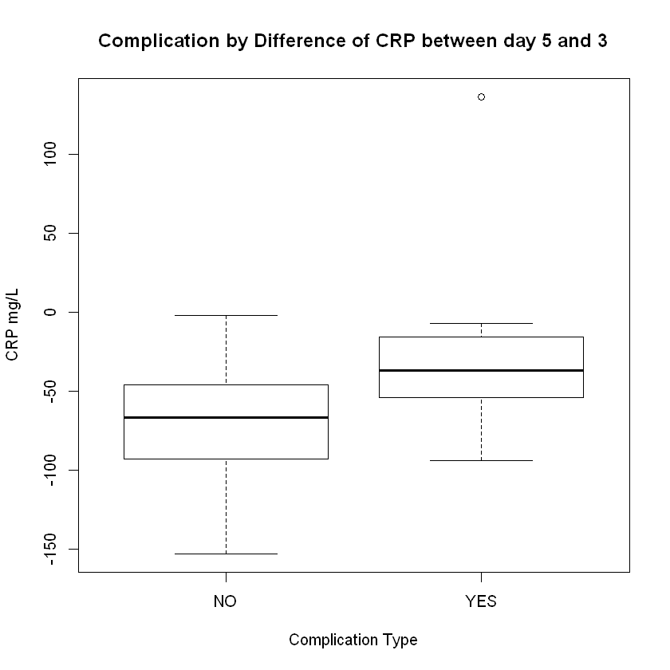
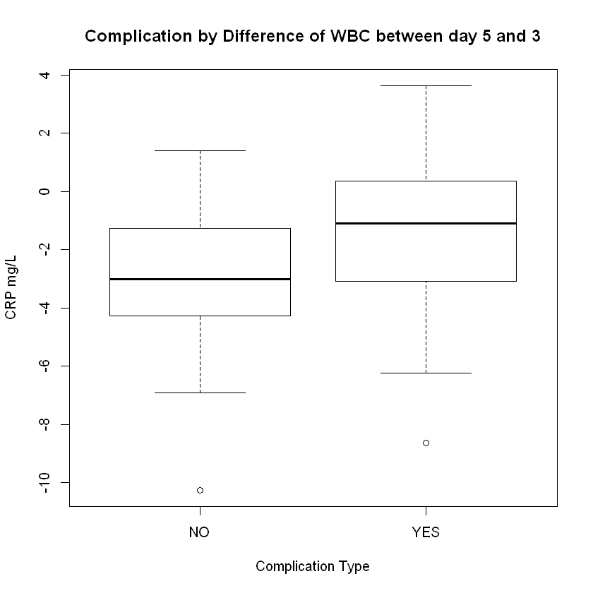
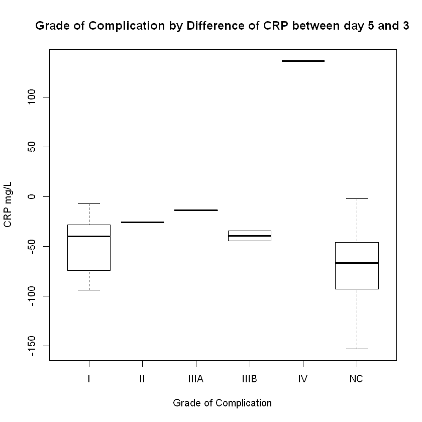
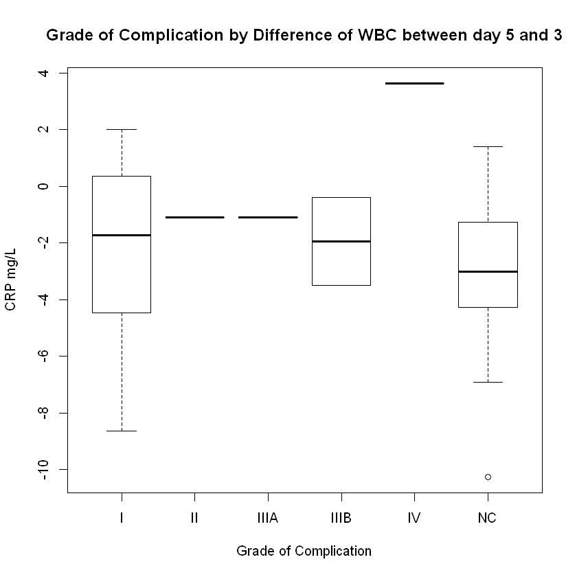
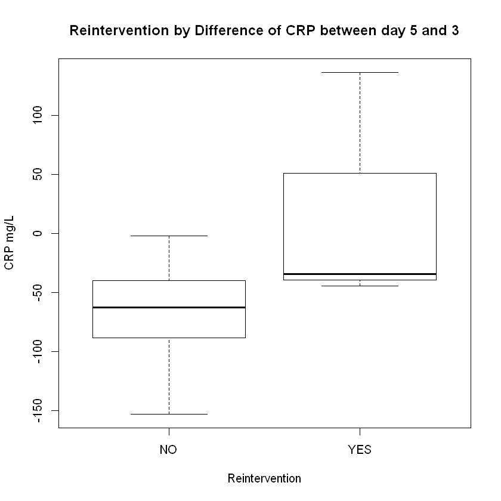
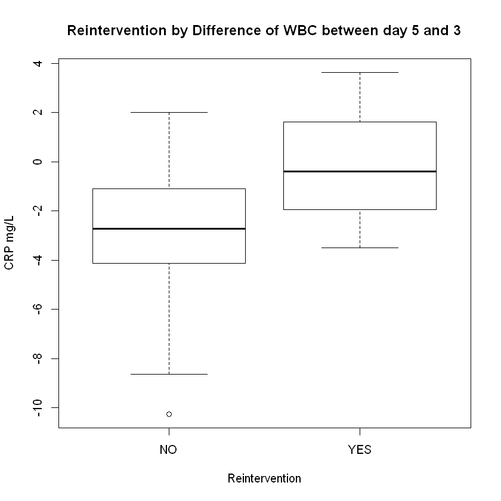
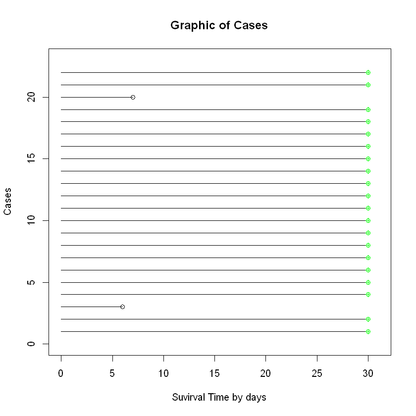
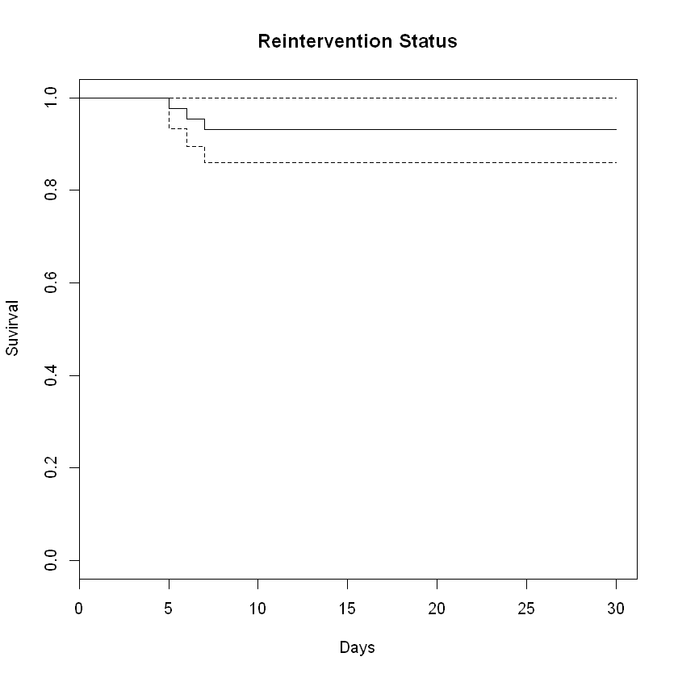
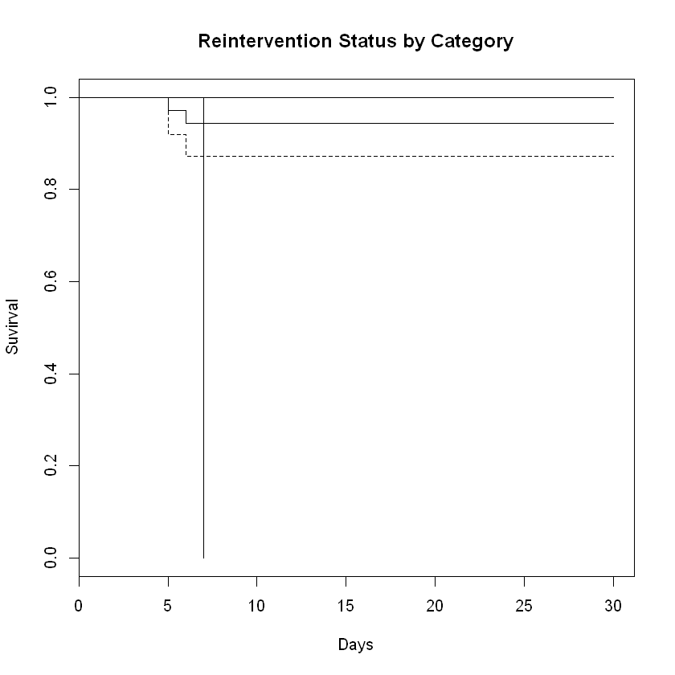

# Methodology and Results


```R
## Install Libraries:
# install.packages("RcmdrMisc")
# install.packages("googlesheets")
# install.packages("dplyr")
# install.packages("FSA")

## Connect Libraries:
library("googlesheets")
library("FSA")
library("psych")
library("gmodels")
library("car")
library("magrittr")
library("survival")

## Connect Google Sheets:
my_sheets <- gs_ls()
gs_ls("DDW_LIGHT")
gap <- gs_title("DDW_LIGHT")
gs_ws_ls(gap)
G <- gap %>% gs_read(ws = "GENERAL");
C <- gap %>% gs_read(ws = "CATEGORIC");
S <- gap %>% gs_read(ws = "SURVIVAL");

## Frequency Tables of Categorical Variables
ftable(G["GENDER"])
ftable(G["PROCEDURE"])
ftable(G["DX"])
ftable(G["COMPLICATION"])
ftable(G["REINTERVENTION"])
ftable(G["GRADE"])

## Descriptive Table of Continuos Variables
describe(G[c(3,10:15)], type=1,) 

# Box Plot for Categorical Variables by Numeric Variables

boxplot(G$DiCRP~G$COMPLICATION, main="Complication by Difference of CRP between day 5 and 3", xlab ="Complication Type", ylab ="CRP mg/L")
boxplot(G$DiWBC~G$COMPLICATION, main="Complication by Difference of WBC between day 5 and 3", xlab ="Complication Type", ylab ="CRP mg/L")
boxplot(G$DiCRP~G$GRADE, main="Grade of Complication by Difference of CRP between day 5 and 3", xlab ="Grade of Complication", ylab ="CRP mg/L")
boxplot(G$DiWBC~G$GRADE, main="Grade of Complication by Difference of WBC between day 5 and 3", xlab ="Grade of Complication", ylab ="CRP mg/L")
boxplot(G$DiCRP~G$REINTERVENTION, main="Reintervention by Difference of CRP between day 5 and 3", xlab ="Reintervention", ylab ="CRP mg/L")
boxplot(G$DiWBC~G$REINTERVENTION, main="Reintervention by Difference of WBC between day 5 and 3", xlab ="Reintervention", ylab ="CRP mg/L")

tablaCFD1 <- xtabs(~G$COMPLICATION+C$CFD)
summary(tablaCFD1)
tablaCFD2 <- xtabs(~G$GRADE+C$CFD)
summary(tablaCFD2)
tablaCFD3 <- xtabs(~G$REINTERVENTION+C$CFD)
summary(tablaCFD3)


# Suvirval Graphics
nr <- 22
plot(c(0, S$TIME[1]), c(1, 1), type = "l", ylim = c(0, nr + + 1), xlim = c(0, max(S$TIME[1:nr]) + 1), main="Graphic of Cases", ylab = "Cases", xlab = "Suvirval Time by days")
for (i in 2:nr) lines(c(0, S$TIME[i]), c(i, i))
for (i in 1:nr) {
    if (S$STATUS1[i] == 0)
    points(S$TIME[i], i, col = "green", pch = 10)
    if (S$STATUS1[i] == 1)
     points(S$TIME[i], i)}
fit1 <- survfit(Surv(S$TIME, S$STATUS1) ~ 1, data=S)
fit3 <- survfit(Surv(S$TIME, S$STATUS1) ~ C$CFD)
plot(fit1, ylab = "Suvirval", xlab = "Days", main="Reintervention Status")
plot(fit3, conf.int = TRUE, ylab = "Suvirval", xlab = "Days", main="Reintervention Status by Category")

# Kaplan-Meier 
survdiff(Surv(S$TIME, S$STATUS1) ~ C$CFD)


# Cox proportional hazards (PH)
fit1 <- coxph(Surv(S$TIME, S$STATUS1) ~ G$DiCRP)
fit3 <- coxph(Surv(S$TIME, S$STATUS1) ~ G$DiCRP+G$DiWBC)
summary(fit1)
summary(fit3)
```


<table>
<thead><tr><th scope=col>sheet_title</th><th scope=col>author</th><th scope=col>perm</th><th scope=col>version</th><th scope=col>updated</th><th scope=col>sheet_key</th><th scope=col>ws_feed</th><th scope=col>alternate</th><th scope=col>self</th><th scope=col>alt_key</th></tr></thead>
<tbody>
	<tr><td>DDW_LIGHT                                                                                                   </td><td>mfm5458                                                                                                     </td><td>rw                                                                                                          </td><td>new                                                                                                         </td><td>2019-04-20 04:49:12                                                                                         </td><td>1q8CD3ugGRvZ9tZ83nOxqe8Hjr2hpSMU0EACzSbU4sOw                                                                </td><td>https://spreadsheets.google.com/feeds/worksheets/1q8CD3ugGRvZ9tZ83nOxqe8Hjr2hpSMU0EACzSbU4sOw/private/full  </td><td>https://docs.google.com/spreadsheets/d/1q8CD3ugGRvZ9tZ83nOxqe8Hjr2hpSMU0EACzSbU4sOw/edit                    </td><td>https://spreadsheets.google.com/feeds/spreadsheets/private/full/1q8CD3ugGRvZ9tZ83nOxqe8Hjr2hpSMU0EACzSbU4sOw</td><td>NA                                                                                                          </td></tr>
</tbody>
</table>


    Sheet successfully identified: "DDW_LIGHT"
    


<ol class=list-inline>
	<li>'GENERAL'</li>
	<li>'CATEGORIC'</li>
	<li>'SURVIVAL'</li>
	<li>'ML'</li>
</ol>


    Accessing worksheet titled 'GENERAL'.
    Parsed with column specification:
    cols(
      ID = col_integer(),
      GENDER = col_character(),
      EDAD = col_integer(),
      PROCEDURE = col_character(),
      DX = col_character(),
      TYPE = col_character(),
      COMPLICATION = col_character(),
      GRADE = col_character(),
      REINTERVENTION = col_character(),
      CRPD3 = col_double(),
      CRPD5 = col_double(),
      WBCD3 = col_double(),
      WBCD5 = col_double(),
      DiCRP = col_double(),
      DiWBC = col_double()
    )
    Accessing worksheet titled 'CATEGORIC'.
    Parsed with column specification:
    cols(
      COMPLICATION = col_character(),
      GRADE = col_character(),
      REINTERVENTION = col_character(),
      CFD = col_character()
    )
    Accessing worksheet titled 'SURVIVAL'.
    Warning message:
    "Missing column names filled in: 'X3' [3]"Parsed with column specification:
    cols(
      TIME = col_integer(),
      STATUS1 = col_integer(),
      X3 = col_character()
    )
    


    x  F  M
           
      21 23


    x APR COLOSTOMY CLOSURE DEGASTROGASTRECTOMY + SPLENECTOMY GASTRECTOMY + SPLENECTOMY + COLECTOMY GASTRIC BYPASS INTESTINAL BYPASS JEJUNECTOMY + COLECTOMY JEJUNECTOMY + COLECTOMY + GASTRECTOMY LEFT HEMICOLECTOMY LEFT HEMICOLECTOMY + TRANSRECTAL RESECTION PELVIC EXENTERATION PROXIMAL GASTRECTOMY RAR RIGHT HEMICOLECTOMY SIGMOIDECTOMY SIGMOIDECTOMY + FISTULA CORRECTION SUBTOTAL GASTRECTOMY TOTAL COLECTOMY TOTAL GASTRECTOMY TOTAL GASTRECTOMY + DISTAL ESOPHAGECTOMY  +  SPLENECTOMY
                                                                                                                                                                                                                                                                                                                                                                                                                                                                                                  
        2                 1                                 1                                     1              2                 5                       1                                     1                  1                                          1                   1                    1   6                   2             2                                  1                    8               1                 5                                                        1


    x CERVICAL CANCER COLON CANCER COLON CANCER + ENTERITIS DIVERTICULAR DISEASE FAP GASTRIC CANCER GIST JEJUNAL CANCER RECTAL CANCER
                                                                                                                                     
                    1           11                        1                    2   1             18    1              1             8


    x NO YES
            
      32  12


    x NO YES
            
      41   3


    x  I II IIIA IIIB IV NC
                           
       7  1    1    2  1 32


<table>
<thead><tr><th></th><th scope=col>vars</th><th scope=col>n</th><th scope=col>mean</th><th scope=col>sd</th><th scope=col>median</th><th scope=col>trimmed</th><th scope=col>mad</th><th scope=col>min</th><th scope=col>max</th><th scope=col>range</th><th scope=col>skew</th><th scope=col>kurtosis</th><th scope=col>se</th></tr></thead>
<tbody>
	<tr><th scope=row>EDAD</th><td>1         </td><td>44        </td><td> 62.250000</td><td>13.235128 </td><td> 61.000   </td><td> 62.722222</td><td>11.119500 </td><td>  30.00   </td><td> 85.00    </td><td> 55.00    </td><td>-0.2750545</td><td>-0.1622612</td><td> 1.9952706</td></tr>
	<tr><th scope=row>CRPD3</th><td>2         </td><td>44        </td><td>162.652955</td><td>82.300919 </td><td>134.340   </td><td>153.592500</td><td>72.298989 </td><td>  43.71   </td><td>396.21    </td><td>352.50    </td><td> 1.0467516</td><td> 0.6798870</td><td>12.4073303</td></tr>
	<tr><th scope=row>CRPD5</th><td>3         </td><td>44        </td><td>103.588864</td><td>83.862284 </td><td> 71.255   </td><td> 90.431111</td><td>49.904316 </td><td>  17.00   </td><td>375.00    </td><td>358.00    </td><td> 1.4701237</td><td> 1.6998381</td><td>12.6427150</td></tr>
	<tr><th scope=row>WBCD3</th><td>4         </td><td>44        </td><td> 11.858636</td><td> 4.061223 </td><td> 11.500   </td><td> 11.777222</td><td> 3.187590 </td><td>   2.41   </td><td> 22.40    </td><td> 19.99    </td><td> 0.1749077</td><td> 0.1747534</td><td> 0.6122523</td></tr>
	<tr><th scope=row>WBCD5</th><td>5         </td><td>44        </td><td>  9.289773</td><td> 3.596102 </td><td>  8.450   </td><td>  8.820556</td><td> 2.653854 </td><td>   4.57   </td><td> 20.10    </td><td> 15.53    </td><td> 1.3167509</td><td> 1.4511292</td><td> 0.5421327</td></tr>
	<tr><th scope=row>DiCRP</th><td>6         </td><td>44        </td><td>-59.064091</td><td>49.305579 </td><td>-59.535   </td><td>-59.865833</td><td>38.384514 </td><td>-153.18   </td><td>136.26    </td><td>289.44    </td><td> 1.0484215</td><td> 4.0131726</td><td> 7.4330957</td></tr>
	<tr><th scope=row>DiWBC</th><td>7         </td><td>44        </td><td> -2.568864</td><td> 2.763983 </td><td> -2.705   </td><td> -2.473889</td><td> 2.446290 </td><td> -10.26   </td><td>  3.64    </td><td> 13.90    </td><td>-0.3887797</td><td> 0.4898988</td><td> 0.4166861</td></tr>
</tbody>
</table>

















    Call: xtabs(formula = ~G$COMPLICATION + C$CFD)
    Number of cases in table: 44 
    Number of factors: 2 
    Test for independence of all factors:
    	Chisq = 3.987, df = 2, p-value = 0.1362
    	Chi-squared approximation may be incorrect


    Call: xtabs(formula = ~G$GRADE + C$CFD)
    Number of cases in table: 44 
    Number of factors: 2 
    Test for independence of all factors:
    	Chisq = 48.85, df = 10, p-value = 4.337e-07
    	Chi-squared approximation may be incorrect


    Call: xtabs(formula = ~G$REINTERVENTION + C$CFD)
    Number of cases in table: 44 
    Number of factors: 2 
    Test for independence of all factors:
    	Chisq = 14.269, df = 2, p-value = 0.000797
    	Chi-squared approximation may be incorrect











    Call:
    survdiff(formula = Surv(S$TIME, S$STATUS1) ~ C$CFD)
    
                         N Observed Expected (O-E)^2/E (O-E)^2/V
    C$CFD=INDETERMINATE  7        0   0.4885    0.4885     0.584
    C$CFD=NEGATIVE      36        2   2.4417    0.0799     0.429
    C$CFD=POSITIVE       1        1   0.0698   12.3980    12.693
    
     Chisq= 13  on 2 degrees of freedom, p= 0.00153 


    Call:
    coxph(formula = Surv(S$TIME, S$STATUS1) ~ G$DiCRP)
    
      n= 44, number of events= 3 
    
                coef exp(coef) se(coef)     z Pr(>|z|)  
    G$DiCRP 0.016398  1.016533 0.006479 2.531   0.0114 *
    ---
    Signif. codes:  0 '***' 0.001 '**' 0.01 '*' 0.05 '.' 0.1 ' ' 1
    
            exp(coef) exp(-coef) lower .95 upper .95
    G$DiCRP     1.017     0.9837     1.004      1.03
    
    Concordance= 0.817  (se = 0.171 )
    Rsquare= 0.101   (max possible= 0.401 )
    Likelihood ratio test= 4.67  on 1 df,   p=0.03068
    Wald test            = 6.41  on 1 df,   p=0.01137
    Score (logrank) test = 7.65  on 1 df,   p=0.005669
    


    Call:
    coxph(formula = Surv(S$TIME, S$STATUS1) ~ G$DiCRP + G$DiWBC)
    
      n= 44, number of events= 3 
    
                coef exp(coef) se(coef)     z Pr(>|z|)
    G$DiCRP 0.016226  1.016358 0.012723 1.275    0.202
    G$DiWBC 0.005348  1.005363 0.342306 0.016    0.988
    
            exp(coef) exp(-coef) lower .95 upper .95
    G$DiCRP     1.016     0.9839    0.9913     1.042
    G$DiWBC     1.005     0.9947    0.5140     1.967
    
    Concordance= 0.817  (se = 0.171 )
    Rsquare= 0.101   (max possible= 0.401 )
    Likelihood ratio test= 4.67  on 2 df,   p=0.09676
    Wald test            = 6.41  on 2 df,   p=0.04065
    Score (logrank) test = 7.67  on 2 df,   p=0.02163
    




